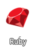

<h1>Hi , I'm Mohamed Hassan Noor:smiley:</h1>
<h2>
  <a href="https://github.com/DenverCoder1/readme-typing-svg">
</h2>

  

 

## Languages and Frameworks:

  
  

## Languages:

  
  
  
  

## Frameworks & Liberaries:

  
  
  
  
  
  
  
  

  
 

## Contact me ⬇️

  
  
  

